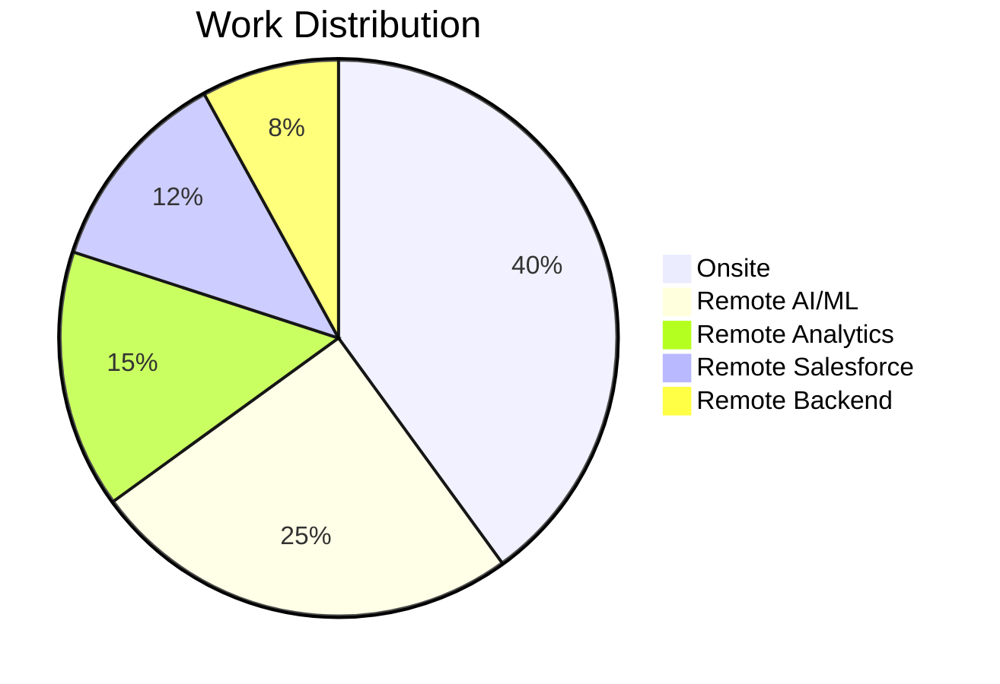
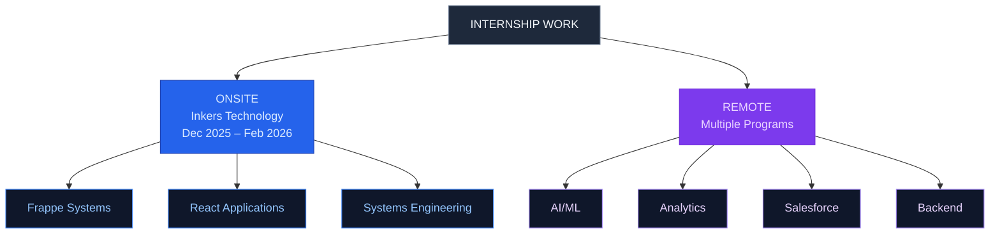
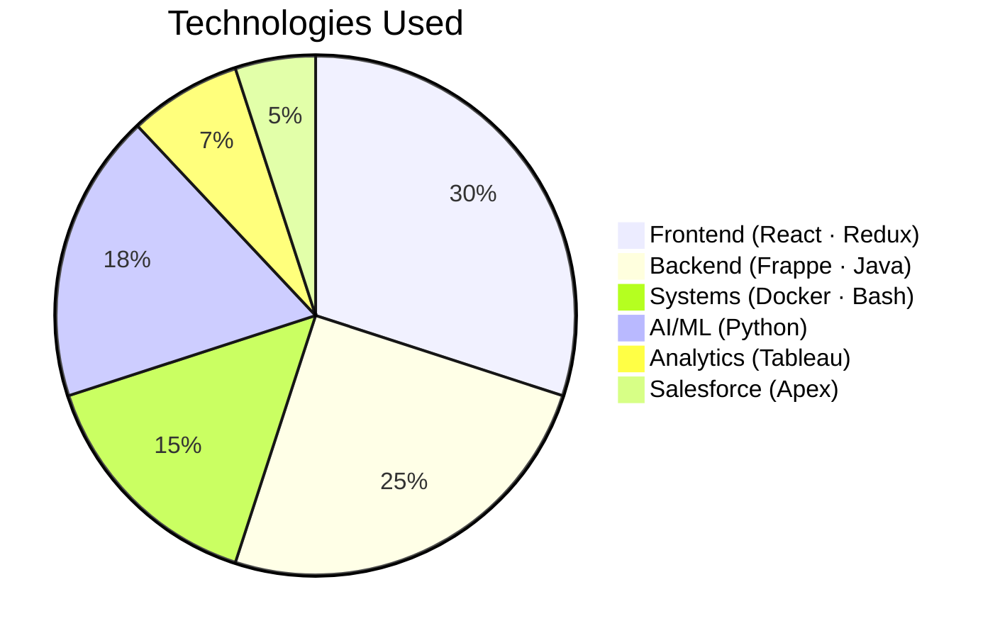
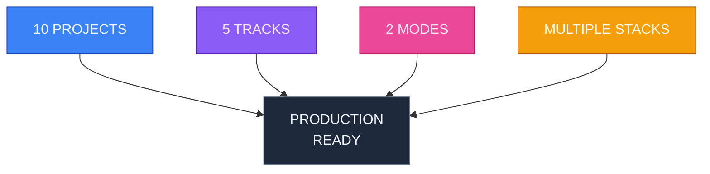

# Internships

**Built across internships. Multiple modes. Multiple stacks. All documented.**

---

## 📊 Overview

---

## 🏗️ What's Inside

---

## 📁 Structure

### Onsite Work
**Inkers Technology** — Full stack engineering, systems, state management
- `/onsite/inkers-technology/` → 4 complete projects

### Remote Work
**Multiple programs** — AI/ML, analytics, Salesforce, backend
- `/remote/ai-ml/` → 3 projects
- `/remote/analytics/` → 1 project
- `/remote/salesforce/` → 1 project
- `/remote/backend/` → 1 project

### Certificates
**Proof of work** — Completion documents, credentials
- `/certificates/` → All internship certificates

---

## 🔄 Development Flow

---

## 💾 Stack Coverage

---

## 🎯 Quick Links

- **[Onsite Projects](/onsite/README.md)** — Frappe, React, Systems Engineering
- **[Remote Projects](/remote/README.md)** — AI/ML, Analytics, Salesforce, Backend
- **[Certificates](/certificates/README.md)** — Credentials & Completion Docs

---

## 📈 Impact

---

## 🚀 By the Numbers

| Metric | Value |
|--------|-------|
| **Projects** | 10 |
| **Internship Programs** | 6+ |
| **Work Modes** | 2 (Onsite + Remote) |
| **Tech Stacks** | 7+ |
| **Certificates** | All documented |

---

**Built. Shipped. Documented.**

*Everything from my internships in one place.*

