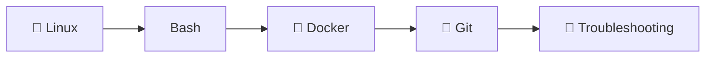
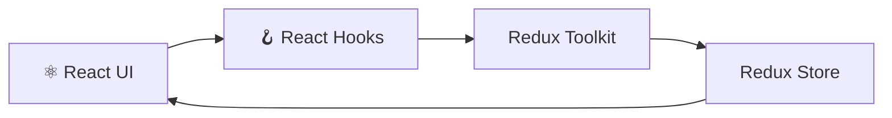
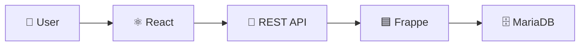
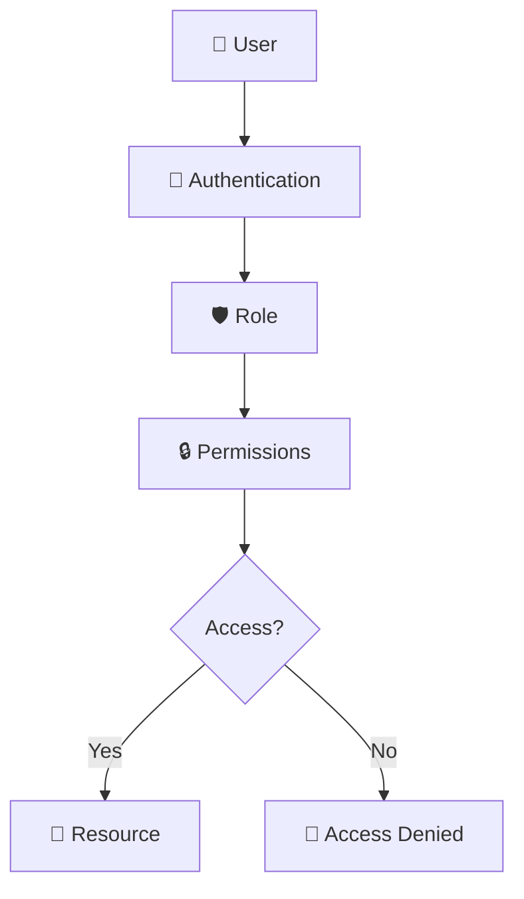
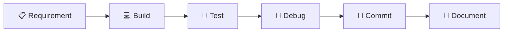

# 
  Inkers Internship Worklog 
 

  
  
  

  
  
  
  
  
  
  
  
  

  December 1, 2025 → March 31, 2026

> **Code is where the work starts. Understanding the system is where the learning begins.**

This repository documents the engineering work completed during my internship, from working with Linux and development tools to building React applications, managing state, connecting APIs, and implementing access control.

## 📂 The Work

| Project                              | Stack                       | Focus                               |
| ------------------------------------ | --------------------------- | ----------------------------------- |
| `Systems-Engineering-Practice` 🖥️   | Linux · Bash · Docker · Git | Systems and development environment |
| `Task-Management-RTK` ⚛️             | React · Redux Toolkit       | Application state and UI            |
| `Task-Manager-Frappe-React` 🔗       | React · REST API · Frappe   | Frontend and backend integration    |
| `frappe-role-based-access-system` 🔐 | React · Python · Frappe     | Users, roles, and permissions       |

## 🖥️ Starting at the System Level

Before building applications, I worked with the tools and environments behind them.

| Topic              | What I learned                                     | Where I used it          |
| ------------------ | -------------------------------------------------- | ------------------------ |
| Linux 🐧           | Files, permissions, processes, and system commands | Linux exercises          |
| Bash `</>`         | Shell commands and basic automation                | Command-line tasks       |
| Docker 🐳          | Images, containers, and container workflows        | Development environments |
| Git 🌿             | Commits, branches, and merges                      | Project version control  |
| Troubleshooting 🔧 | Finding issues and working through fixes           | Development environments |

## ⚛️ Building the Interface

The first application work focused on turning requirements into a usable interface and learning how application state moves through a React application.

| Topic            | What I learned                              | Where I used it    |
| ---------------- | ------------------------------------------- | ------------------ |
| React ⚛️         | Component-based UI development              | Task management UI |
| React Hooks 🪝   | Component state and behaviour               | Forms and UI logic |
| Redux Toolkit 🔄 | Shared application state                    | Task data          |
| Redux Slices 🧩  | Feature-based state organization            | Task state         |
| Redux Store 🗄️  | Centralized application state               | Application state  |
| CRUD ✏️          | Create, read, update, and delete operations | Task operations    |

## 🔗 Connecting the Pieces

Once the interface was in place, the work moved into communication between the frontend, backend, API layer, and database.

| Topic             | What I learned                     | Where I used it    |
| ----------------- | ---------------------------------- | ------------------ |
| React ⚛️          | Frontend development               | Task management UI |
| React Hooks 🪝    | State and component logic          | Forms and API data |
| REST API 🔗       | Frontend and backend communication | React → Frappe     |
| CRUD ✏️           | Managing application records       | Task management    |
| Frappe 🟦         | Backend application development    | Task backend       |
| Authentication 🔐 | User authentication                | Application access |
| MariaDB 🗄️       | Backend data storage               | Task records       |

## 🔐 Controlling Access

With users and data connected, the next layer was deciding what each user could see and do.

| Topic              | What I learned                     | Where I used it     |
| ------------------ | ---------------------------------- | ------------------- |
| User Management 👥 | Creating and managing users        | User onboarding     |
| Roles 🛡️          | Assigning access based on roles    | User access         |
| DocPerm 📄         | Configuring document permissions   | Frappe permissions  |
| Authentication 🔐  | Controlling authenticated access   | Login flow          |
| Authorization 🔒   | Controlling actions based on roles | Protected resources |
| Admin Controls ⚙️  | Managing users and permissions     | Admin interface     |

## 🔄 How the Work Came Together

Across the projects, the workflow stayed practical: understand the requirement, build the feature, test it, investigate problems, and keep the changes organized.

| Step          | What I learned                          | Where I used it           |
| ------------- | --------------------------------------- | ------------------------- |
| Understand 🧠 | Break requirements into smaller tasks   | All projects              |
| Develop 💻    | Turn requirements into working features | All projects              |
| Test 🧪       | Check expected application behaviour    | React and Frappe projects |
| Debug 🐛      | Trace issues and work through fixes     | Development work          |
| Commit 🌿     | Keep changes organized with Git         | All projects              |
| Document 📝   | Record the work and learning            | This worklog              |

## 📊 Project Status

| Project                              | Status       | What it covered                                  |
| ------------------------------------ | ------------ | ------------------------------------------------ |
| `Systems-Engineering-Practice` 🖥️   | 🟢 Completed | Linux, Bash, Docker, Git, and troubleshooting    |
| `Task-Management-RTK` ⚛️             | 🟢 Completed | React, Hooks, Redux Toolkit, and CRUD            |
| `Task-Manager-Frappe-React` 🔗       | 🟢 Completed | React, APIs, Frappe, authentication, and MariaDB |
| `frappe-role-based-access-system` 🔐 | 🟢 Completed | Users, roles, permissions, and authorization     |

## 👀 Looking Back

The work progressed from the foundations underneath an application to the interface users interact with, the services behind it, and the rules that control access.

That progression is what makes this worklog useful to me. Each project added another piece to the picture.

  <b>Four projects. One progression: from the environment to the application.</b>

  Inkers Internship · December 1, 2025 → March 31, 2026

