# Microsoft Fabric Learning Notes (Uday's POV)

# Why I Was Asked To Do These Labs

From my understanding, Kiran Anna and Deepanshu Sir did not ask me to complete every lab feature. The primary goal was to validate:

- Microsoft Fabric access
- Workspace creation
- Lakehouse functionality
- Notebook execution
- SQL Endpoint availability
- Pipeline execution
- Copilot readiness
- Environment dependencies

The objective was to confirm that the lab environment works for future users.

---

# What is Microsoft Fabric?

Microsoft Fabric is Microsoft's unified data and analytics platform.

Instead of using multiple separate services:

- Azure Data Factory
- Azure Synapse Analytics
- Power BI
- Data Lake
- Spark
- SQL Analytics

Fabric brings them into one platform.

## Traditional Approach

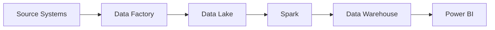

## Microsoft Fabric Approach

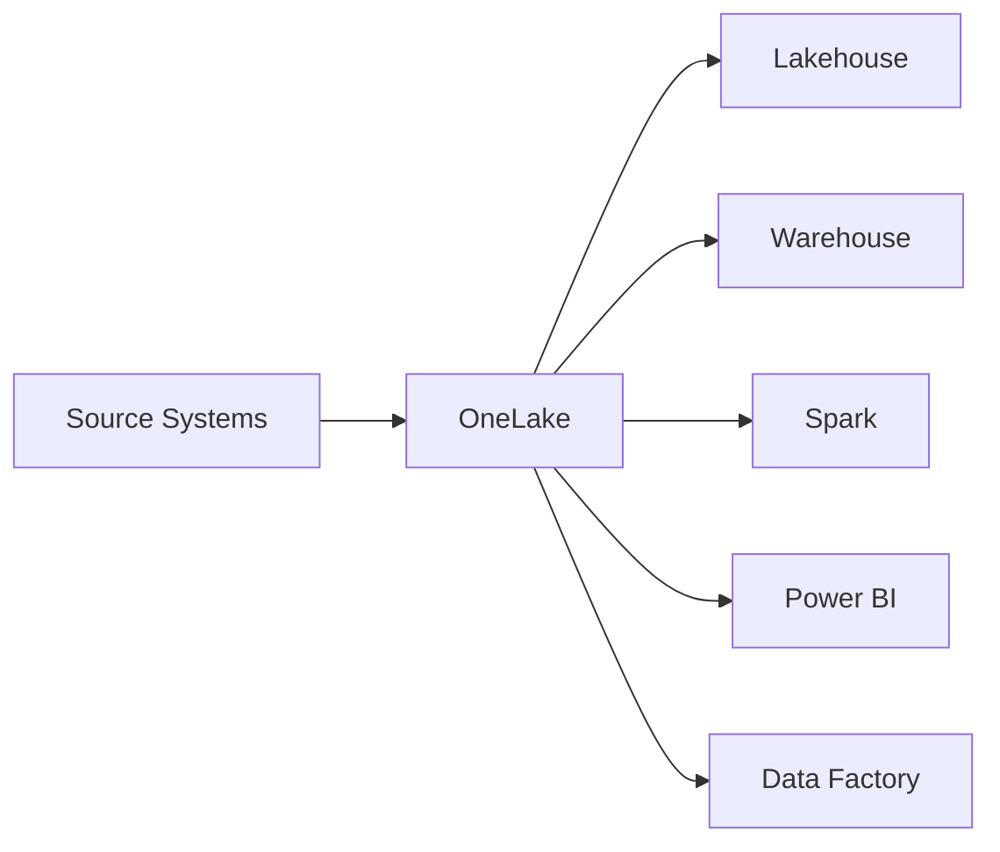

Single platform.
Single storage.
Single security model.
Single governance layer.

---

# Lab 02 - Analyze Data With Apache Spark

## What I Understood

This lab is focused on raw data analysis.

The goal is:

1. Upload CSV files.
2. Read them using Spark.
3. Create DataFrames.
4. Transform data.
5. Save as Parquet.
6. Create Delta Tables.
7. Query data using SQL.
8. Visualize results.

## Architecture

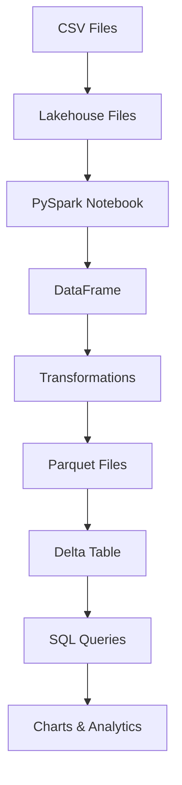

## Key Learning

Spark is mainly used when:

- Data becomes large
- Transformations are complex
- Distributed processing is required
- Notebook based analytics are needed

Example:

```python
sales_df.groupBy("Product").sum("Revenue")
```

---

# Lab 03b - Medallion Architecture

This was the most important lab because it explains how enterprise data platforms are usually built.

## Medallion Architecture

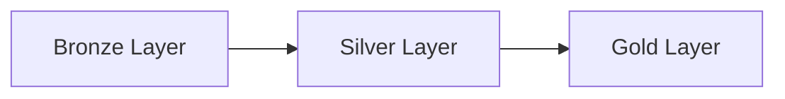

## Bronze Layer

Raw data.

Examples:

- CSV
- JSON
- API dumps
- Log files

No business rules.

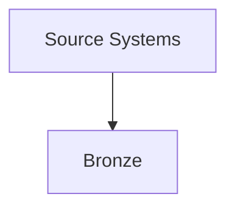

## Silver Layer

Cleaned data.

Activities:

- Remove duplicates
- Fix nulls
- Add audit columns
- Standardize format

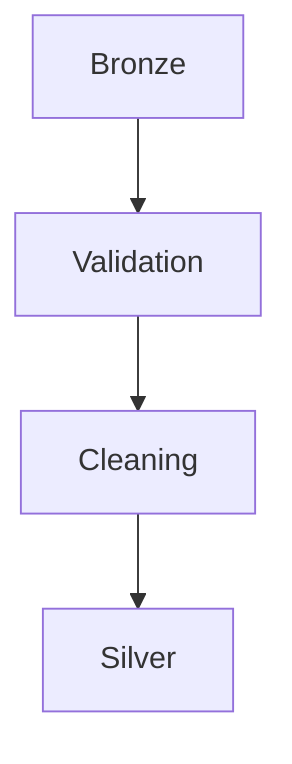

## Gold Layer

Business ready data.

Used by:

- Power BI
- Reports
- Dashboards
- Analysts

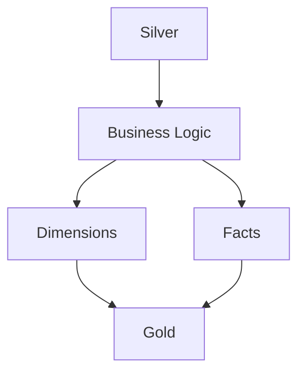

## Star Schema Created

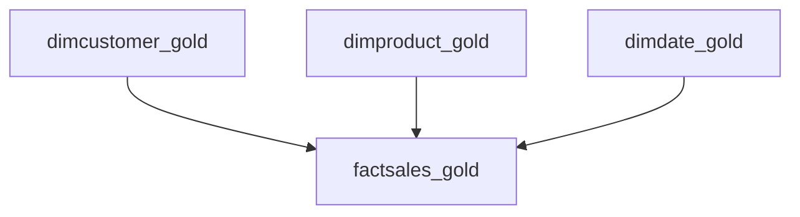

## What I Actually Validated

- Workspace creation
- Lakehouse creation
- Bronze upload
- Notebook execution
- Silver processing
- SQL Analytics Endpoint
- Gold table creation
- Fact and Dimension tables

---

# Lab 04 - Pipeline Ingestion

## What I Understood

This lab explains data automation.

Instead of manually:

- Downloading file
- Uploading file
- Running notebook

Fabric Pipeline automates everything.

## Architecture

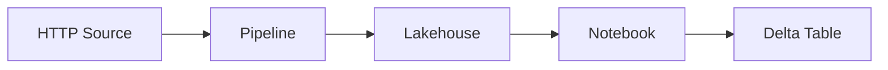

## Final Pipeline

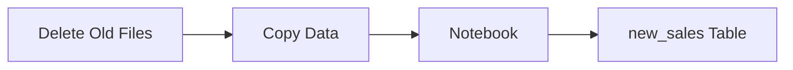

## Why Pipelines Matter

Production systems do not have engineers manually running notebooks every day.

Pipelines automate:

- Scheduling
- Monitoring
- Retry handling
- Data movement
- Notebook execution

---

# Actual Coding vs Microsoft Fabric

## Traditional Software Engineering

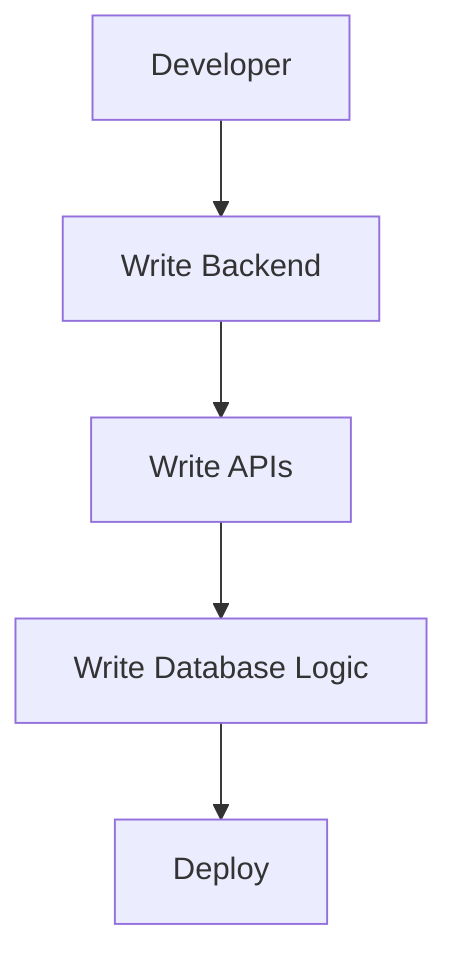

Examples:

- MERN Stack
- Java Spring Boot
- .NET
- Node.js
- Python Applications

Focus:

Application development.

---

## Fabric Approach

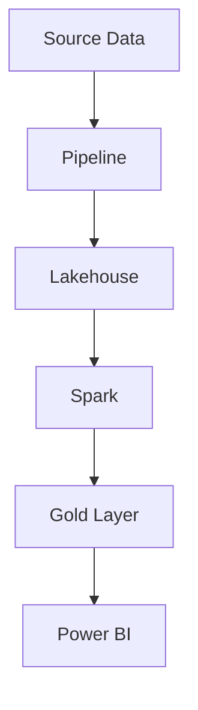

Focus:

Data engineering.

---

# When To Use Coding

| Use Case | Coding Required? |
|-----------|-----------|
| Build Website | Yes |
| Build Mobile App | Yes |
| Build API | Yes |
| Authentication System | Yes |
| Business Application | Yes |

---

# When To Use Microsoft Fabric

| Use Case | Fabric Suitable? |
|-----------|-----------|
| Data Warehousing | Yes |
| ETL Process | Yes |
| Data Analytics | Yes |
| Reporting | Yes |
| Business Intelligence | Yes |
| Large Data Processing | Yes |

---

# Advantages of Fabric

| Advantage | Benefit |
|------------|----------|
| OneLake | Single storage layer |
| Integrated Spark | No separate Spark setup |
| Power BI Integration | Reporting becomes easier |
| Pipelines | Easy automation |
| Lakehouse | Supports files and tables |
| Delta Tables | ACID support |

---

# Disadvantages of Fabric

| Limitation | Reason |
|-----------|-----------|
| Vendor Lock-in | Mostly Microsoft ecosystem |
| Learning Curve | Many Fabric components |
| Capacity Costs | Can become expensive |
| Less Flexibility | Compared to fully custom solutions |

---

# My Personal Understanding After Completing Labs

If I compare Fabric with traditional software engineering:

Traditional development focuses on building applications.

Microsoft Fabric focuses on moving, transforming, storing, and analysing enterprise data.

A Software Engineer might build an e-commerce website.

A Data Engineer using Fabric builds the platform that collects sales data, cleans it, creates analytical models, and enables dashboards for business users.

My takeaway from Labs 02, 03b, and 04:

1. Lab 02 taught me Spark fundamentals.
2. Lab 03b taught me enterprise Medallion Architecture.
3. Lab 04 taught me ETL orchestration using Pipelines.
4. Together they form a real-world Data Engineering workflow.

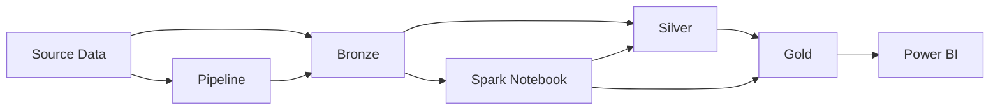

This architecture is what I now see as the foundation of many modern analytics platforms built on Microsoft Fabric.
