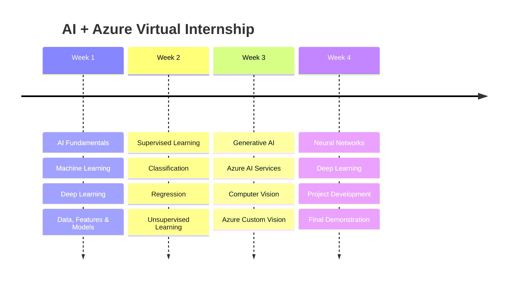

# Edunet AI + Azure Virtual Internship (May–June 2025)

  
  

## Learning Journey

> [!TIP]
> **The internship ended. The project didn't.**
>
> During this internship, I developed **Ani Compass**, a machine learning–based anime recommendation system using unsupervised learning techniques. The project was successfully submitted as part of the internship and contributed to earning the completion certificate.
>
> After the internship, I continued improving the project by restructuring it into a standalone open-source repository with better documentation, organization, and future enhancements.
>
> **Project Repository →** **https://github.com/udaycodespace/ani-compass**

## Certificate

  

Click the certificate to view the original PDF.

