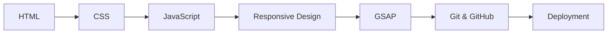
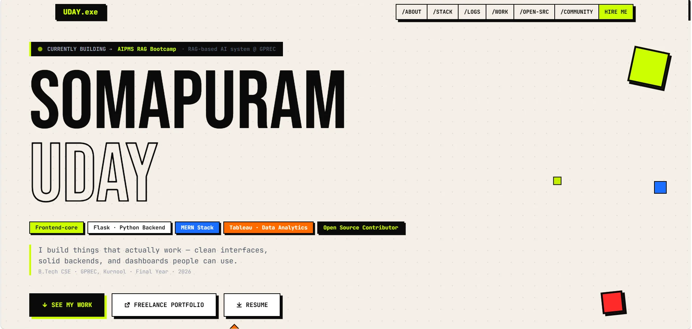

# Edunet Foundation

## Front End Web Development Internship

  
  
  

---

## About

This repository contains the work completed during my **6-week Front End Web Development Internship** offered by **Edunet Foundation** through the **AICTE Internship Portal** in collaboration with **IBM SkillsBuild**.

The internship provided hands-on experience in modern front-end development through practical assignments, project-based learning, and real-world implementation of web technologies.

---

## What I Learned

- HTML5
- CSS3
- JavaScript (ES6)
- Responsive Web Design
- GSAP Animations
- Git
- GitHub
- Browser Developer Tools
- Project Deployment

---

## Learning Journey

> [!TIP]
> **The internship ended. The project didn't.**
>
> This repository preserves the work completed during the internship. Since then, I've continued improving the project with new features, UI enhancements, and performance improvements.
>
> **Looking for the latest version?** → **https://udaycodespace.github.io/portfolio/**

---

## Latest Project Preview

  

Click the preview to explore the latest version of the project.

---

## Certificate

  

Click the certificate to view the original PDF.

