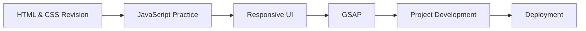

# Edunet Foundation

<p align="center">
  
  
  
</p>

## About

This repository contains the work completed during my **6-week Front End Web Development Internship** offered by **Edunet Foundation** through the **AICTE Internship Portal** in collaboration with **IBM SkillsBuild**.

During the internship, I strengthened my front-end fundamentals, practiced modern JavaScript, explored GSAP animations, and built responsive web projects while following Git and GitHub workflows.

## Timeline

```text
21 Aug 2025                                            30 Sep 2025
Internship Started 🚀────────────────────────Internship Completed 🎉
             Front End Web Development • 6 Weeks
```

## Technologies

* HTML5
* CSS3
* JavaScript (ES6)
* GSAP
* Responsive Web Design
* Git
* GitHub

## Learning Journey



> [!TIP]
> **The internship ended. The project didn't.**
>
> This repository preserves the work completed during the internship. Since then, I've continued improving the project with new features, UI enhancements, and performance improvements.
>
> **Looking for the latest version?** → **https://udaycodespace.github.io/portfolio/**

## Latest Project Preview

<p align="center">
  <a href="https://udaycodespace.github.io/portfolio/">
    
  </a>
</p>

<p align="center">
Click the preview to explore the latest version of the project.
</p>

## Certificate

<p align="center">
  <a href="https://github.com/udaycodespace/internships/blob/main/artifacts/certificates/edunet-frontend-webdevelopment.pdf">
    
  </a>
</p>

<p align="center">
Click the certificate to view the original PDF.
</p>
