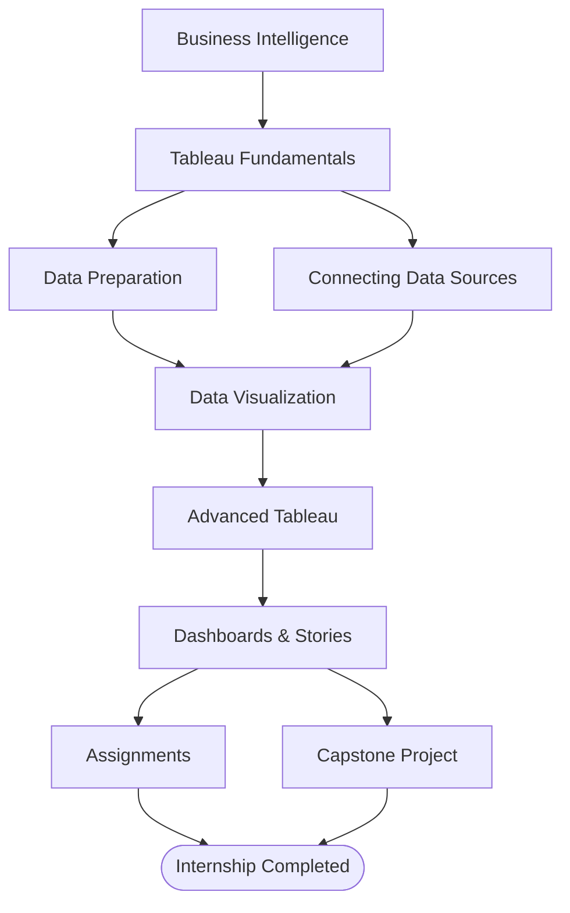
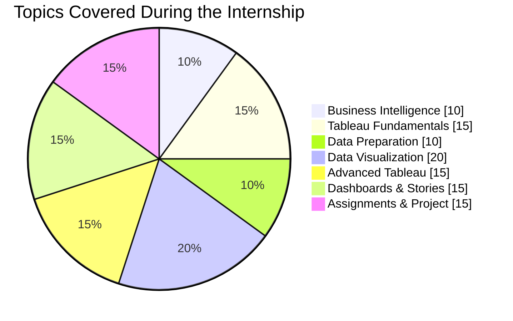
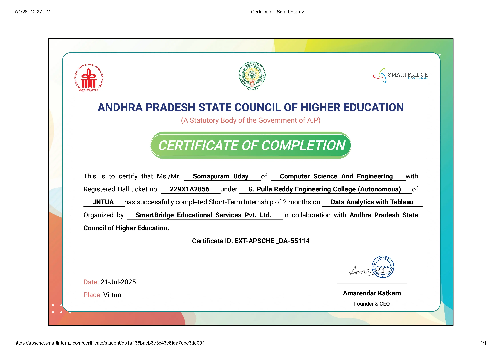

# Data Analytics with Tableau Internship · SmartInternz

<p align="center">
  
  
  
</p>

## Learning Journey



> [!NOTE]
> During the **Data Analytics with Tableau Internship**, I learned the fundamentals of **Business Intelligence**, **Tableau**, and **Data Visualization** while completing practical assignments and a capstone analytics project.
>
> - **Assignments** → [`assignments/`](assignments/)
> - **Project** → [`project/`](project/)

> [!TIP]
> Looking for more Tableau dashboards beyond this internship?
>
> **Explore my Tableau Public portfolio:**  
> <https://public.tableau.com/app/profile/somapuram.uday/vizzes>

<p align="center">
  <a href="https://public.tableau.com/app/profile/somapuram.uday/vizzes">
    
  </a>
</p>

## Repository Structure

```text
.
├── assignments/
│   ├── 01-supermarket-sales-analysis.pdf
│   ├── 02-advanced-supermarket-visualization.pdf
│   ├── 03-supermarket-sales-dashboard.pdf
│   └── README.md
│
├── project/
│   ├── 01-ideation/
│   ├── 02-requirements-analysis/
│   ├── 03-project-design/
│   ├── 04-project-planning/
│   ├── 05-project-files/
│   ├── 06-testing/
│   ├── 07-documentation/
│   └── README.md
│
└── README.md
```

## Knowledge Distribution



## Certificate

<p align="center">
  <a href="../../../artifacts/certificates/smartbridge-data-analytics-tableau.pdf">
    
  </a>
</p>

<p align="center">
Click the certificate preview to open the original PDF.
</p>