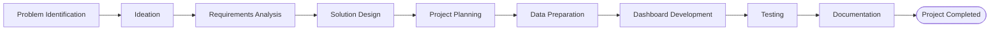

<p align="center">
  <a href="https://public.tableau.com/views/Cosmetic_Insights_Tableau_Project/Dashboard1">
    
  </a>
  <a href="https://github.com/udaycodespace/Cosmetic-Insights-Tableau-Project">
    
  </a>
</p>

<h1 align="center">
Cosmetic Insights 💄
</h1>

<p align="center">
An end-to-end Tableau analytics project exploring cosmetic industry trends, customer behavior, and product performance through interactive dashboards.
</p>

---

## About

Most Tableau repositories stop at publishing a dashboard.

This repository goes beyond the final visualization by documenting the complete analytics workflow—from understanding the problem to delivering an interactive business intelligence solution.

Alongside the Tableau dashboards, it includes planning artifacts, requirement analysis, project design, testing, documentation, and presentation materials created throughout the project lifecycle.

---

## Project Journey



---

## Project Highlights

| | |
|---|---|
| **End-to-End Analytics Workflow** | Covers every major phase of an analytics project instead of only the final dashboard. |
| **Interactive Dashboards** | Multiple Tableau dashboards with filters, visual storytelling, and business insights. |
| **Business Documentation** | Includes ideation, requirements, architecture, planning, reports, and presentation. |
| **Real Internship Deliverables** | Repository structure mirrors the deliverables submitted during the internship project. |

---

## Technology Stack

| Tool | Purpose |
|------|---------|
| Tableau Public | Dashboard Development |
| Tableau Desktop | Workbook Development |
| Microsoft Excel | Data Preparation |
| CSV Dataset | Source Data |
| PDF | Project Documentation |

---

## Repository Structure

```text
.
├── 01-ideation/
│   Brainstorming, Problem Statement & Empathy Map
│
├── 02-requirements-analysis/
│   Requirement Analysis & Technology Stack
│
├── 03-project-design/
│   Solution Design & Architecture
│
├── 04-project-planning/
│   Project Planning Documents
│
├── 05-project-files/
│   Dataset, Tableau Workbook & Dashboard Assets
│
├── 06-testing/
│   Functional Testing Reports
│
├── 07-documentation/
│   Final Report, Presentation & Demo Resources
│
└── README.md
```

---

## Explore the Project

| Resource | Link |
|----------|------|
| Tableau Workbook | **[Open Workbook](https://public.tableau.com/views/Cosmetic_Insights_Tableau_Project/Dashboard1)** |
| Dashboard 1 | **[View Dashboard](https://public.tableau.com/views/Cosmetic_Insights_Dashboard_1/Dashboard1)** |
| Dashboard 2 | **[View Dashboard](https://public.tableau.com/views/Cosmetic_Insights_Dashboard_2/Dashboard2)** |
| Dashboard 3 | **[View Dashboard](https://public.tableau.com/views/Cosmetic_Insights_Dashboard_3/Dashboard3)** |
| Story | **[View Story](https://public.tableau.com/views/Cosmetic_Insights_Story/Story1)** |
| Demo Video | **[Watch Demo](https://drive.google.com/file/d/1MsVV5ywteTWxaNzCil0Fwcyfkxwhz5z9/view)** |

---

## Deliverables

- Tableau Workbook (.twbx)
- Interactive Dashboards
- Tableau Story
- Dataset
- Requirement Analysis
- Solution Design
- Project Planning
- Functional Testing
- Final Report
- Project Presentation
- Demo Video

---

## Project Context

This project was completed as part of the **SmartInternz APSCHE Virtual Internship** under the **Data Analytics with Tableau** track.

---

<p align="center">
Built using Tableau for interactive business intelligence and data visualization.
</p>