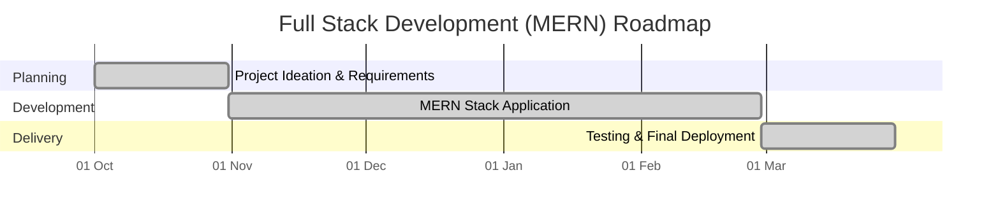
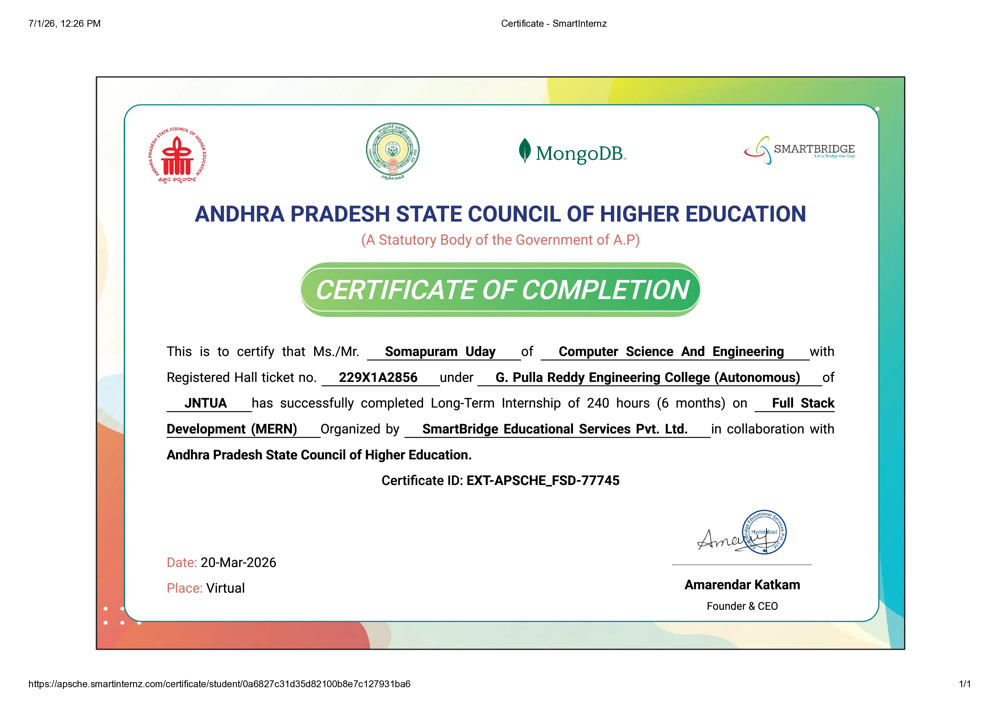

# SmartBridge Full Stack Development (MERN) Internship

  
  

---

## Development Roadmap

> [!TIP]
> **The internship ended. The project didn't.**
>
> Learn Hub started as part of this internship, but I chose to keep building it after the program ended. As the project grew beyond the scope of the internship, it earned its own dedicated repository.
>
> **Looking for the project?** → **[Learn Hub](https://github.com/udaycodespace/learn-hub)**

## Certificate

  

Click the certificate to view the original PDF.

