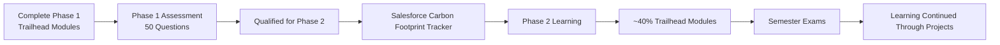

# Salesforce Internship · SmartBridge × TCS

<p align="center">
  
  
</p>

<p align="center">
  
</p>

## Learning journey



## About

This repository contains my work from the **SmartBridge Salesforce Internship** conducted in collaboration with **TCS**.

The internship followed a two-phase learning path.

To become eligible for **Phase 2**, I first completed the required Trailhead modules and cleared a **50-question Salesforce assessment**. After qualifying, I built the **Salesforce Carbon Footprint Tracker**, where I applied what I had learned by developing a complete Salesforce application.

Phase 2 focused on advanced Trailhead modules and another Salesforce project. I completed the assigned project and around **40% of the required modules** before my university semester examinations overlapped with the internship schedule. Once the exams concluded, the internship deadline had already passed.

Although I didn't complete every Trailhead module, the internship achieved what I had set out to learn. It gave me practical experience with Salesforce development and a solid understanding of the platform through building, experimenting, and solving real problems instead of only earning badges.

## Skills gained

- Salesforce CRM Fundamentals
- Apex
- Lightning Web Components (LWC)
- Salesforce Flows
- Custom Objects & Relationships
- Reports & Dashboards
- Profiles, Roles & Permissions
- SOQL
- Validation Rules
- Application Development Lifecycle

## Repository

```text
.
├── projects/
│   └── carbon-footprint-tracker/
└── README.md
```

## Trailblazer Profile

My Trailblazer profile documents the badges and modules completed during the internship.

🔗 **https://www.salesforce.com/trailblazer/somapuram-uday**

> [!NOTE]
> This repository represents my Salesforce learning journey. While I did not complete the entire Phase 2 learning path, the knowledge and projects gained during the internship are accurately reflected here and on my Trailblazer profile.