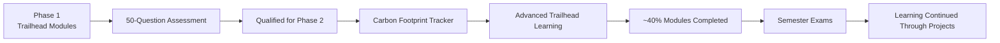

# Salesforce Internship · SmartBridge × TCS

<p align="center">
  
  
</p>

<p align="center">
  
</p>

---

## Program Timeline



## Highlights

✔ Completed all required **Phase 1 Trailhead modules**

✔ Cleared the **50-question Salesforce assessment**

✔ Qualified for **Phase 2**

✔ Built the **Salesforce Carbon Footprint Tracker**

✔ Completed the assigned **Phase 2 project**

✔ Completed **~40%** of the Phase 2 Trailhead learning path

---

## About the Internship

The SmartBridge Salesforce Internship, conducted in collaboration with **TCS**, followed a two-phase learning program.

Phase 1 focused on Salesforce fundamentals through Trailhead modules, followed by a qualifying assessment.

After advancing to Phase 2, I built a complete Salesforce application while continuing the advanced learning path. Although I couldn't finish every Trailhead module because the remaining schedule overlapped with my university semester examinations, I completed the project and gained practical Salesforce development experience through hands-on implementation.

---

## Technologies & Concepts

- Apex
- Lightning Web Components (LWC)
- Salesforce Flows
- Custom Objects & Relationships
- SOQL
- Validation Rules
- Reports & Dashboards
- Profiles, Roles & Permissions
- Salesforce CRM Fundamentals

---

## Repository Structure

```text
.
├── projects/
│   └── carbon-footprint-tracker/
└── README.md
```

---

## Trailblazer Profile

🔗 https://www.salesforce.com/trailblazer/somapuram-uday

> [!TIP]
> This repository showcases the practical work completed during the SmartBridge × TCS Salesforce Internship. While the complete Phase 2 Trailhead path wasn't finished due to semester examinations, the projects and Trailblazer profile accurately reflect the Salesforce skills gained throughout the program.