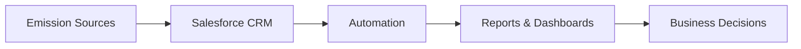
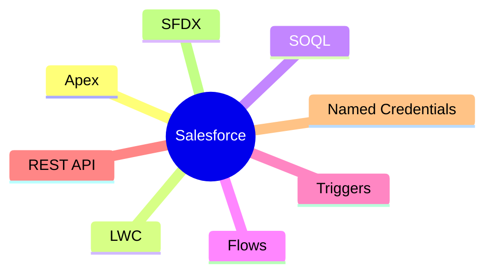
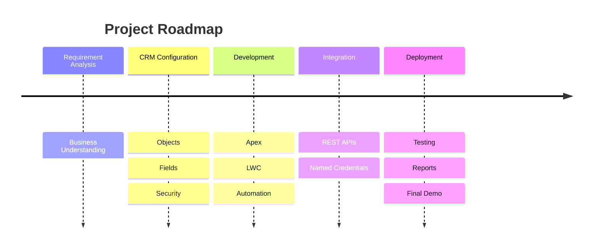

# 🌍 Salesforce Carbon Footprint Tracker

A Salesforce CRM solution that helps organizations capture, manage, automate, and analyze carbon emission data for sustainability reporting and ESG compliance.


## Architecture



## Project Snapshot

```text
Industry      → Sustainability / ESG
Platform      → Salesforce CRM
Backend       → Apex
Frontend      → Lightning Web Components
Automation    → Flows • Triggers • Validation Rules
Goal          → Carbon Emission Management
```

## Problem

Organizations often manage carbon emissions across spreadsheets, ERP systems, and third-party tools, making reporting inconsistent, time-consuming, and difficult to audit.

## Solution

This project centralizes emission records inside Salesforce and automates validation, tracking, reporting, and notifications to provide a single source of truth.

## Features

- Carbon emission management
- Custom Salesforce objects
- Apex business logic
- Lightning Web Components
- Flow automation
- Validation Rules
- Reports & Dashboards
- REST API integration
- Role-based security
- Audit-ready records

## Tech Stack



## Development Journey



## Repository Structure

```text
force-app/
config/
manifest/
scripts/
docs/
```

## Demo

🎥 **Project Walkthrough**

https://drive.google.com/file/d/1_tq5sqcE4iIgMsderQ1Jk-SDYqrqJ5Wc/view?usp=sharing

## Author

**Somapuram Uday**