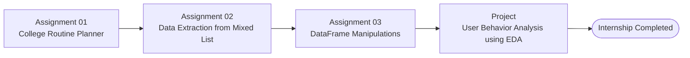

# AI/ML SIT2025 Internship · The Web Blinders

  
  
  

---

## Internship Journey

> [!NOTE]
> This repository preserves my work completed during the **AI/ML SIT2025 Internship** at **The Web Blinders**.
>
> * **Assignments** → [`assignments/`](assignments/)
> * **EDA Project** → [`projects/`](projects/)

## Certificate

  

Click the certificate to view the original PDF.

