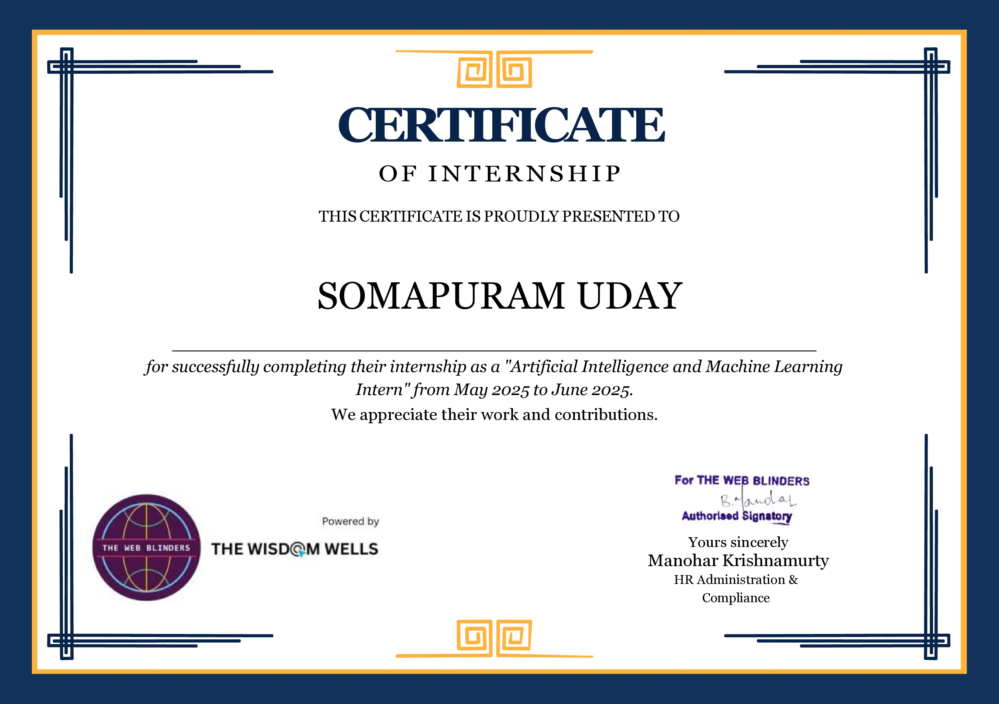

# AI/ML SIT2025 Internship · The Web Blinders

  
  
  

---

## Learning Journey

```mermaid
flowchart LR

A["Python Fundamentals<br/>Variables · Data Types · Operators"]
--> B["Core Python<br/>Conditions · Loops · Functions · Collections"]
--> C["Assignment 01<br/>College Routine Planner"]
--> D["Assignment 02<br/>Data Extraction from Mixed List"]
--> E["Assignment 03<br/>DataFrame Manipulations with pandas"]
--> F["Artificial Intelligence<br/>Theory & Core Concepts"]
--> G["Data Science<br/>Exploratory Data Analysis (EDA)"]
--> H["Project<br/>User Behavior Analysis"]
--> I["Machine Learning<br/>Theory & Fundamentals"]
--> J(["Internship Completed"])
```

> [!NOTE]
> During the **AI/ML SIT2025 Internship**, I completed the practical assignments and project contained in this repository while learning the theoretical foundations of **Artificial Intelligence**, **Machine Learning**, and **Data Science**.
>
> * **Assignments** → [`assignments/`](assignments/)
> * **Project** → [`projects/`](projects/)

## Certificate

  

Click the certificate to view the original PDF.

