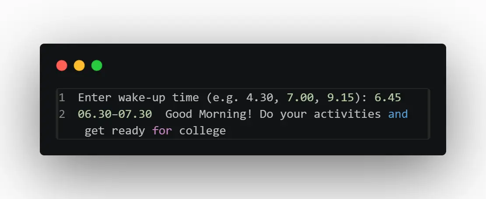

# Assignment 01 · College Routine Planner

> **Track:** AI/ML SIT2025
> **Organization:** The Web Blinders
> **Assignment:** 01

This repository contains **Assignment 01** completed as part of the **AI/ML Track** at **The Web Blinders**.

The assignment focuses on implementing a **College Routine Planner** using Python's `if-elif-else` conditional statements to recommend activities based on the user's wake-up time.

## Repository Contents

| File                | Description                                        |
| ------------------- | -------------------------------------------------- |
| 📄 `QUESTION.md`    | Assignment statement, objectives, and requirements |
| 📓 `solution.ipynb` | Complete Jupyter Notebook solution                 |
| 🖼 `output.webp`    | Sample program output                              |

## Quick Navigation

* 📄 **Assignment:** [QUESTION.md](QUESTION.md)
* 📓 **Solution:** [solution.ipynb](solution.ipynb)

## Sample Output

## Explore More

This assignment is part of a larger collection of **AI/ML SIT2025** assignments developed during **The Web Blinders** training program.

Explore the repository to discover more assignments covering:

* Python Programming
* Problem Solving
* Data Analysis
* Machine Learning Fundamentals
* Artificial Intelligence Concepts

---

**Author:** SOMAPURAM UDAY
