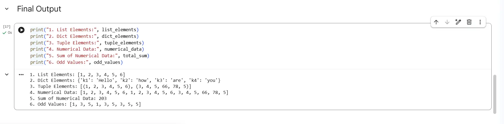

# Assignment 02 · Data Extraction from Mixed List

> **Track:** AI/ML SIT2025
>
> **Organization:** The Web Blinders
>
> **Assignment:** 02

This repository contains the second assignment completed as part of the **AI/ML Track** at **The Web Blinders**.

The objective of this assignment is to extract, filter, and process data from a mixed Python list containing lists, tuples, and dictionaries.

## Repository Guide

| File | Description |
|------|-------------|
| 📄 `QUESTION.md` | Assignment problem statement and requirements |
| 📓 `solution.ipynb` | Complete Jupyter Notebook solution |
| 🖼 `output.webp` | Sample program output |

## Quick Links

👉 **Read the assignment:** [QUESTION.md](QUESTION.md)

👉 **View the solution:** [solution.ipynb](solution.ipynb)

## Final Output

## Explore More

Browse the remaining assignments in the **AI/ML SIT2025** series to explore Python fundamentals, data analysis, machine learning, and AI concepts completed during **The Web Blinders** training program.

---

**Author:** SOMAPURAM UDAY