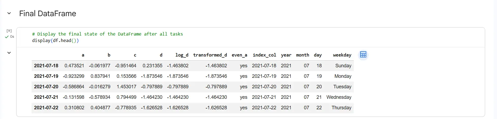

# Assignment 03 · Project Qualification – DataFrame Manipulations

> **Track:** AI/ML SIT2025
>
> **Organization:** The Web Blinders
>
> **Assignment:** 03

This repository contains the third assignment completed as part of the **AI/ML Track** at **The Web Blinders**.

The objective of this assignment is to perform various **DataFrame manipulations** using Python and pandas while avoiding high-level shortcuts such as `.apply()` and `.dt`.

## Repository Guide

| File | Description |
|------|-------------|
| 📄 `QUESTION.md` | Assignment problem statement and requirements |
| 📓 `solution.ipynb` | Complete Jupyter Notebook solution |
| 🖼 `output.webp` | Final DataFrame after completing all tasks |

## Quick Links

👉 **Read the assignment:** [QUESTION.md](QUESTION.md)

👉 **View the solution:** [solution.ipynb](solution.ipynb)

## Final Output

## Explore More

Browse the remaining assignments in the **AI/ML SIT2025** series to explore Python fundamentals, data analysis, machine learning, and AI concepts completed during **The Web Blinders** training program.

---

**Author:** SOMAPURAM UDAY